<div align="center">



<a href="https://git.io/typing-svg"></a>

<a href="https://mazharul-islam-cse.vercel.app"></a>
<a href="mailto:imazharul175@gmail.com"></a>
<a href="https://github.com/MAZHAR1807102"></a>
<a href="https://www.linkedin.com/in/mazharul-islam-ba946320a/"></a>
<a href="https://scholar.google.com/citations?user=BxSurLEAAAAJ&hl=en"></a>
<a href="https://doi.org/10.1109/QPAIN69676.2026.11545584"></a>

</div>

<br />

## 👋 About me

- 🎓 **Lecturer** in Computer Science & Engineering at **Imperial College of Engineering, Khulna**
- 🔬 Researching **machine-learning-based intrusion detection** for IoT networks
- 🧑‍🏫 Teaching computer science since **2018**
- 🏛️ B.Sc. in CSE from **Khulna University of Engineering & Technology (KUET)**
- 🤝 Open to **research collaborations** and always happy to hear from students
- ⚽ Off the clock: football and photography

<br />

## 🔬 Research focus

<table>
  <tr>
    <td width="50%" valign="top">
      <h3>🛡️ Network &amp; IoT Security</h3>
      Protecting connected devices and the traffic between them.
    </td>
    <td width="50%" valign="top">
      <h3>🔍 Intrusion Detection</h3>
      Machine-learning models that spot malicious traffic quickly and reliably.
    </td>
  </tr>
  <tr>
    <td width="50%" valign="top">
      <h3>📡 Mobile Ad Hoc Networks</h3>
      Secure routing in networks without fixed infrastructure.
    </td>
    <td width="50%" valign="top">
      <h3>🤖 Machine Learning</h3>
      Ensemble and boosting methods for security and real-world data.
    </td>
  </tr>
</table>

<br />

## 📄 Publications

> [!NOTE]
> **Robust and Efficient: A Boosting-Based Intrusion Detection Framework for IoT Networks on CICIoT2023 Dataset**<br />
> **Mazharul Islam**, Puspita Singha<br />
> *2026 IEEE 2nd International Conference on Quantum Photonics, Artificial Intelligence & Networking (QPAIN)*, pp. 1–6<br />
> [](https://doi.org/10.1109/QPAIN69676.2026.11545584)

<details>
<summary><b>📋 Cite this paper (BibTeX)</b></summary>

```bibtex
@inproceedings{islam2026robust,
  author    = {Islam, Mazharul and Singha, Puspita},
  title     = {Robust and Efficient: A Boosting-Based Intrusion Detection
               Framework for {IoT} Networks on {CICIoT2023} Dataset},
  booktitle = {2026 IEEE 2nd International Conference on Quantum Photonics,
               Artificial Intelligence \& Networking (QPAIN)},
  year      = {2026},
  pages     = {1--6},
  doi       = {10.1109/QPAIN69676.2026.11545584}
}
```

</details>

<details>
<summary><b>🎓 Undergraduate thesis</b></summary>

<br />

**Secure and Reliable Data Forwarding Against Blackhole and Wormhole Attacks in Mobile Ad Hoc Networks** (KUET)

A forwarding scheme built on the AOMDV multipath routing protocol, combined with an enhanced homomorphic cryptosystem (keys up to 2048 bits) to protect data integrity. Simulated in NS-2.35.

</details>

<br />

## 🛠️ Tech stack

<p align="center">
  
  <br />
  
</p>

<p align="center">
  
  
  
  
  
  
  
  
  
</p>

<br />

## 🚀 Selected projects

<table>
  <tr>
    <td width="50%" valign="top">
      <h3>📝 Online Examination System</h3>
      Remote MCQ and written exams with separate student, teacher and admin panels, question management and live timers.
      <br /><br />
      
    </td>
    <td width="50%" valign="top">
      <h3>🛺 Riksa Mama</h3>
      Rickshaw booking app with in-app payment for riders and passengers.
      <br /><br />
      
      
    </td>
  </tr>
  <tr>
    <td width="50%" valign="top">
      <h3>🩺 Doctor Finder</h3>
      Doctor and patient profiles, category search and appointment booking, with a PL/SQL database edition.
      <br /><br />
      
      
      
    </td>
    <td width="50%" valign="top">
      <h3>✅ Daily Task Manager</h3>
      An iOS app for tracking daily activities.
      <br /><br />
      
      
    </td>
  </tr>
  <tr>
    <td width="50%" valign="top">
      <h3>☕ KUET Cafeteria</h3>
      A computer graphics scene of the KUET cafeteria.
      <br /><br />
      
      
    </td>
    <td width="50%" valign="top">
      <h3>🔐 MANET Secure Forwarding</h3>
      Thesis simulation: blackhole and wormhole attack avoidance with homomorphic encryption.
      <br /><br />
      
      
    </td>
  </tr>
</table>

## 📊 GitHub stats

<p align="center">
  
  
</p>

<br />

## 🏆 Achievements

- 🥇 **Technical Scholarship**, KUET, every semester
- 🎖️ **Education Board Scholarships** in PSC, JSC and SSC examinations
- 🧭 **Organizing Secretary**, Organization of KUET Sports (OKS)

<br />

<div align="center">

**📫 Let's connect:** [imazharul175@gmail.com](mailto:imazharul175@gmail.com)


</div>
